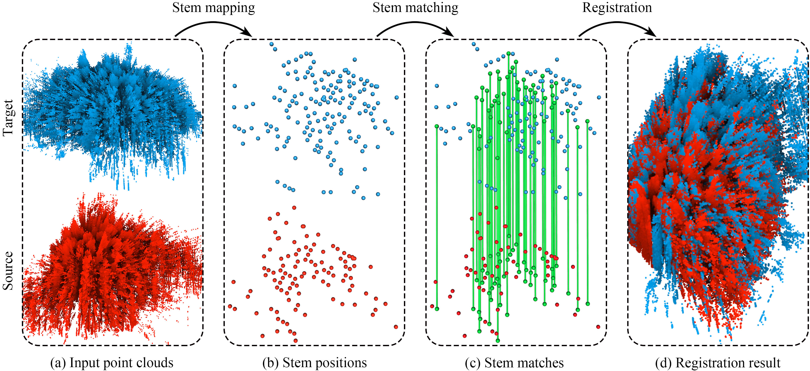

# GlobalMatch

<p align="center"> 
  
<p/>

This is the official implementation of the method described in the
following paper (see [the published version on ISPRS](https://www.sciencedirect.com/science/article/pii/S0924271623000199) 
or [our preprint on arXiv](https://arxiv.org/abs/2112.11121)):

```
Xufei Wang, Zexin Yang, Xiaojun Cheng, Jantien Stoter, Wenbing Xu, Zhenlun Wu, and Liangliang Nan. 
GlobalMatch: Registration of forest terrestrial point clouds by global matching of relative stem positions.
ISPRS Journal of Photogrammetry and Remote Sensing. Vol. 197, 71-86, 2023.
```

## Build

The current implementation depends on the [Point Cloud Library (PCL)](https://pointclouds.org) and its dependencies
(e.g., [Eigen](https://eigen.tuxfamily.org/index.php?title=Main_Page) and the [Visualization Toolkit (VTK)](https://vtk.org)).
Please install [PCL](https://pointclouds.org/downloads/#cross-platform) (and its dependencies) first.

To build GlobalMatch, you need [CMake](https://cmake.org/download/) (`>= 3.12`) and a compiler that
supports `>= C++14`.
With CMake, GlobalMatch can be built on almost all platforms, 
although so far we have only tested it on Linux (GCC >= 4.8, Clang >= 3.3).

There are many options to build GlobalMatch. Choose one of the following (not an exhaustive list):

- Option 1 (purely on the command line): Use CMake to generate Makefiles and then `make` (on Linux/macOS) or `nmake`(on
  Windows with Microsoft
  Visual Studio).
    - On Linux or macOS, you can simply
      ```
      $ cd path-to-root-dir-of-GlobalMatch
      $ mkdir Release
      $ cd Release
      $ cmake -DCMAKE_BUILD_TYPE=Release ..
      $ make
      ```
    - On Windows with Microsoft Visual Studio, use the `x64 Native Tools Command Prompt for VS XXXX` (**don't** use the
      x86 one), then
      ```
      $ cd path-to-root-dir-of-GlobalMatch
      $ mkdir Release
      $ cd Release
      $ cmake -G "NMake Makefiles" -DCMAKE_BUILD_TYPE=Release ..
      $ nmake
      ```

- Option 2: 
  Use any IDE that can directly handle CMakeLists files to open the `CMakeLists.txt` in the **root** directory
  of GlobalMatch. 
  Then you should have obtained a usable project and just build it. 
  I personally highly recommend using [CLion](https://www.jetbrains.com/clion/). 
  For Windows users: your IDE must be set for `x64`.

- Option 3: 
  Use CMake-Gui to generate project files for your IDE. 
  Then load the project to your IDE and build it. 
  For Windows users: your IDE must be set for `x64`.

Don't have any experience with C/C++ programming?
Have a look at <a href="https://github.com/LiangliangNan/Easy3D/blob/main/HowToBuild.md">Liangliang's step-by-step
tutorial</a>.

## Usage

We have split GlobalMatch into two classes - [Mapping](./code/global_match/stem_mapping.h) 
and [Matching](./code/global_match/stem_matching.h) - to make it easier to use. 
The [main.cpp](./code/global_match/main.cpp) file demonstrates how to use it for pairwise registration. 
To register a "source" forest point cloud to a "target" one, run the built executable like this:
```commandline
./GlobalMatch  <source_scan_ply_file>  <target_scan_ply_file>  <output_matrix_txt_file>
```
- `<source_scan_ply_file>` and `<target_scan_ply_file>` specify the path to the input point cloud **ply** files (**order matters**: source filename comes first)
- `<output_matrix_txt_file>` specifies the filename to save the estimated 4 by 4 transformation matrix

## Benchmark Dataset

The *Tongji-Trees* dataset, as part of our work, is introduced to complement the scarce publicly available data for
evaluating marker-free registration methods for forest TLS scans.
The dataset (including raw scans, ground-truth matrices, and our estimated matrices) can be downloaded from the links
below:

|   Dataset    | Google Drive  | Baidu Wangpan  |     Size     |
|:------------:|:-------------------------------------------------------------------------------------------------------------------------:|:-----------------------------------------------------------------------------------------------------------------------:|:------------:|
| Tongji-Trees |                                   [Download link](https://forms.gle/c8BXMHYTqd1iULBv8)                                    |                                  [Download link](https://wj.qq.com/s2/11690595/201c/)                                   | approx. 10GB |

**Disclaimer**:
The estimated matrices you obtain may differ slightly from our provided ones due to the stochastic nature of our stem mapping algorithm.

## Citation
We kindly ask you to cite our paper if you use (part of) the code, ideas, or dataset in your academic work:

```bibtex
@article{wang2023globalmatch,
  title={GlobalMatch: Registration of forest terrestrial point clouds by global matching of relative stem positions},
  author={Wang, Xufei and Yang, Zexin and Cheng, Xiaojun and Stoter, Jantien and Xu, Wenbing and Wu, Zhenlun and Nan, Liangliang},
  journal={ISPRS Journal of Photogrammetry and Remote Sensing},
  volume={197},
  pages={71--86},
  year={2023},
  publisher={Elsevier}
}
```

---------

Please feel free to contact me at [zexinyang@tongji.edu.cn](zexinyang@gzpi.com.cn) with questions, comments, or suggestions ;-)

**_Zexin Yang_**

December 21, 2021
